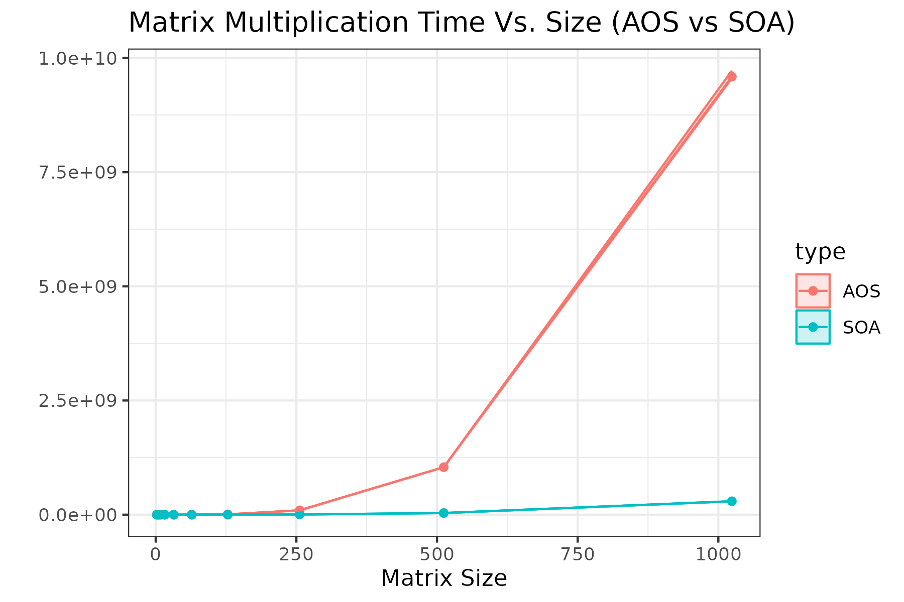
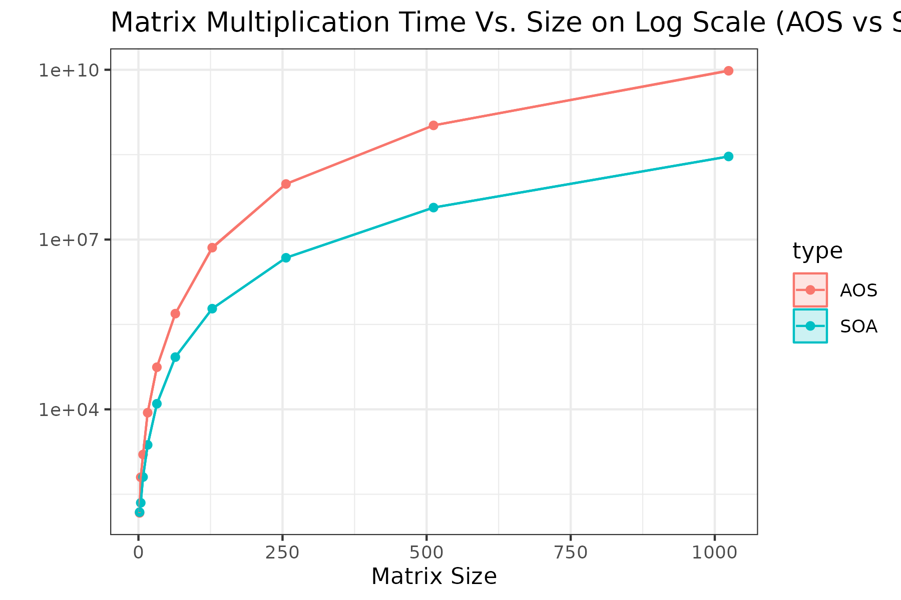

# stan-perf
Performance Testing Suite for the Stan C++ libraries

### Steps to Run matmul for Struct of Arrays and Array of Structs Examples

1. Build the project in a build directory

```bash
cmake -S . -B "build" -DCMAKE_BUILD_TYPE=Release
cd ./build
# After you are in the build file you can call `cmake ..` to re-run cmake
```

2. Compile the google bench binaries

```bash
make matmul_soa matmul_aos
```

3. Run each test saving their results to local folder. Here we use `taskset -c 0` to pin the benchmark to the first cpu.

```bash
taskset -c 11 ./benchmarks/matmul_aos_soa/matmul_soa --benchmark_out_format=csv --benchmark_out=./benchmarks/matmul_aos_soa/matmul_soa.csv --benchmark_repetitions=30 --benchmark_report_aggregates_only=false
taskset -c 11 ./benchmarks/matmul_aos_soa/matmul_aos --benchmark_out_format=csv --benchmark_out=./benchmarks/matmul_aos_soa/matmul_aos.csv --benchmark_repetitions=30 --benchmark_report_aggregates_only=false
```

4. Run the script to plot the results.

```bash
Rscript ./scripts/matmul_aos_soa/plot.R
```


